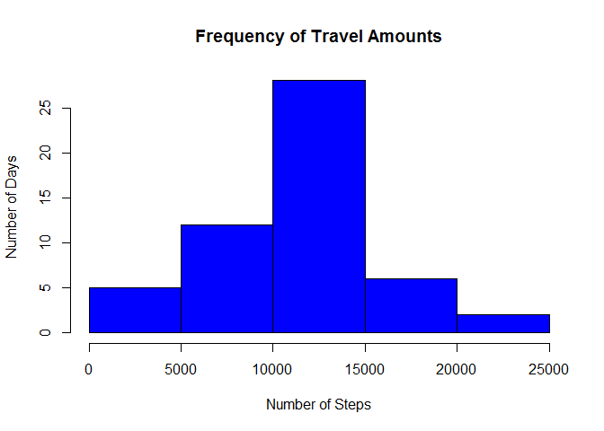
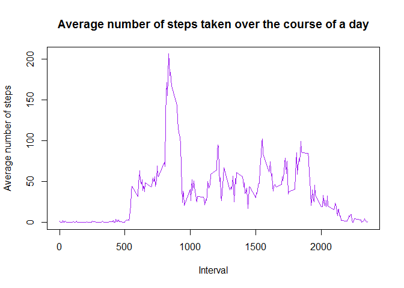
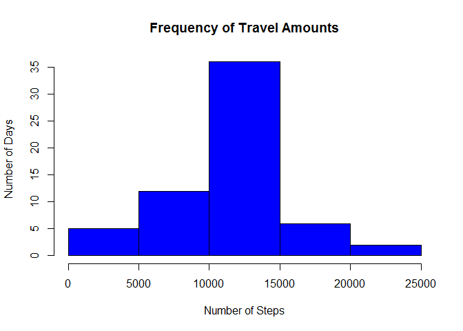
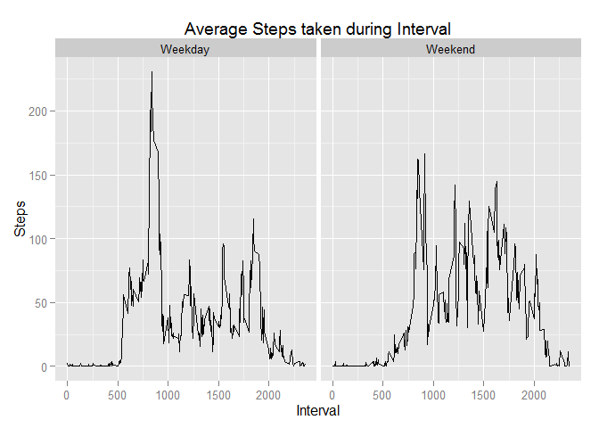

# Reproducible Research: Peer Assessment 1
BMc  
Sunday, February 15, 2015  


## Loading and preprocessing the data

```r
library(dplyr)
library(ggplot2)
```

#### Unzip and read in csv of data
The data file is read from the local working directory.  However, there are many records which are incomplete.  For this data analysis, we'll pare it down to just complete records while saving the full data set (this is needed for backfilling, which will occur at a later step).

The data file was initially provided from https://d396qusza40orc.cloudfront.net/repdata%2Fdata%2Factivity.zip and can also be found in the current GitHub repository at: 


```r
data <- read.csv(unz("repdata_data_activity.zip", "activity.csv"))
summary(data)
```

```
##      steps                date          interval     
##  Min.   :  0.00   2012-10-01:  288   Min.   :   0.0  
##  1st Qu.:  0.00   2012-10-02:  288   1st Qu.: 588.8  
##  Median :  0.00   2012-10-03:  288   Median :1177.5  
##  Mean   : 37.38   2012-10-04:  288   Mean   :1177.5  
##  3rd Qu.: 12.00   2012-10-05:  288   3rd Qu.:1766.2  
##  Max.   :806.00   2012-10-06:  288   Max.   :2355.0  
##  NA's   :2304     (Other)   :15840
```

```r
data_complete <- data[complete.cases(data),]
summary(data_complete)
```

```
##      steps                date          interval     
##  Min.   :  0.00   2012-10-02:  288   Min.   :   0.0  
##  1st Qu.:  0.00   2012-10-03:  288   1st Qu.: 588.8  
##  Median :  0.00   2012-10-04:  288   Median :1177.5  
##  Mean   : 37.38   2012-10-05:  288   Mean   :1177.5  
##  3rd Qu.: 12.00   2012-10-06:  288   3rd Qu.:1766.2  
##  Max.   :806.00   2012-10-07:  288   Max.   :2355.0  
##                   (Other)   :13536
```

## What is mean total number of steps taken per day?


```r
# Sum subset grouping of steps based on the date.
data3 <- aggregate(list(steps = data_complete$steps), 
                   list(date=data_complete$date), FUN=sum)

# Create a histogram of travel frequency
hist(data3$steps, xlab = "Number of Steps", ylab = "Number of Days", 
     main = "Frequency of Travel Amounts", col="blue")
```

 

#### The average number of steps taken each day is:


```r
mean(data3$steps)
```

```
## [1] 10766.19
```

```r
median(data3$steps)
```

```
## [1] 10765
```

## What is the average daily activity pattern?


```r
# Calculate average on subset grouping of steps based on the date.
avgStepsPerInterval <- aggregate(list(steps = data_complete$steps), 
                  list(interval=data_complete$interval), FUN=mean)

# Graph the data
plot(avgStepsPerInterval$steps ~ avgStepsPerInterval$interval, 
     type="l", xlab = "Interval", 
     ylab = "Average number of steps", 
     main = "Average number of steps taken over the course of a day", 
     col="purple")
```

 


#### The time period where the maximum average number of steps is taken is:

```r
avgStepsPerInterval[avgStepsPerInterval$steps == max(avgStepsPerInterval$steps),
                    "interval"]
```

```
## [1] 835
```

## Inputing missing values

#### Number of incomplete records: 

```r
missing <- data[!complete.cases(data),]
nrow(missing)
```

```
## [1] 2304
```

At this point, a join is done of the incomplete records (the "missing" data frame) and the dataframe containing the average number of steps taken during each interval ("avgStepsPerInterval").  The interpolated records are then joined with the records which were already complete to make a new, "full", dataset.  


```r
# Join is done, taking columns ""
filled_in <- inner_join(missing[,c("date", "interval")], avgStepsPerInterval[,c("interval", "steps")], 
                        by = "interval")
full <- rbind(data[complete.cases(data),],filled_in)
full <- full[order(full$date, full$interval),]
summary(full)
```

```
##      steps                date          interval     
##  Min.   :  0.00   2012-10-01:  288   Min.   :   0.0  
##  1st Qu.:  0.00   2012-10-02:  288   1st Qu.: 588.8  
##  Median :  0.00   2012-10-03:  288   Median :1177.5  
##  Mean   : 37.38   2012-10-04:  288   Mean   :1177.5  
##  3rd Qu.: 27.00   2012-10-05:  288   3rd Qu.:1766.2  
##  Max.   :806.00   2012-10-06:  288   Max.   :2355.0  
##                   (Other)   :15840
```


```r
data5 <- aggregate(list(steps = full$steps), by=list(date=full$date), FUN=sum)
hist(data5$steps, xlab = "Number of Steps", ylab = "Number of Days", 
     main = "Frequency of Travel Amounts", col="blue")
```

 

```r
mean(data5$steps)
```

```
## [1] 10766.19
```

```r
median(data5$steps)
```

```
## [1] 10766.19
```


## Are there differences in activity patterns between weekdays and weekends?

```r
# The below code will convert the date field to the relevant day of the week
# If the day is Saturday or Sunday, "Weekend" will be stored in the calculated
# field "WeekendWeekday".  Otherwise, "Weekday" will be stored.
full$WeekendWeekday <- ifelse(weekdays(as.Date(full$date)) == "Saturday" | 
                                 weekdays(as.Date(full$date)) == "Sunday", 
                               "Weekend", "Weekday")

avgStepsPerDayType <- aggregate(list(steps = full$steps), 
                   list(interval=full$interval, DayType=full$WeekendWeekday), 
                   FUN=mean)

# Split the graph into two parts based on the Day Type ("Weekend"/"Weekday")
data_plot <- qplot(interval, steps, data = avgStepsPerDayType, 
                      xlab="Interval", ylab="Steps", 
                      main="Average Steps taken during Interval", geom="line")
data_plot <- data_plot + facet_grid(. ~ DayType)
print(data_plot)
```

 
